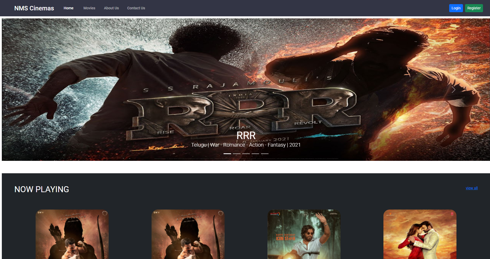

# my-movie-plan

My Movie Plan is a dynamic and responsive web application for booking movie tickets online for different genres and
languages.

## Requirements

1. Java - 1.8
2. Maven - 3.x.x
3. Spring Boot - 2.2.1.RELEASE
4. Spring Security
5. JWT (Json Web Token package)
6. Spring Data JPA
7. MySQL
8. H2-Database
9. PostgreSQL
10. Lombok
11. Git and GitHub
12. Agile Scrum Methodology
13. Docker
14. Jenkins

## Steps to Set up

NOTE:

1. Please do remember to change the 'spring.datasource.url' property value in application-prod.properties file where
    your database is running.
2.  Also do change the ip address of backend in the front-end application as well. For more details please check - https://github.com/JRiyaz/my-movie-plan.git

**1.0 Go to official Amazon Web Services site**

```bash
https://console.aws.amazon.com/ec2
```

**2.0 Create New Instance**


**3.0 Connect to the Instance**


**4.0 Open Command Prompt in your machine and navigate to the path where you have downloaded the pem file**

```bash
cd Downloads
```

**5.0 Connect to EC2 Instance by executing the '3rd and example' commands in the ec2 instance**

```bash
chmod 400 my-movie-plan.pem
ssh -i "my-movie-plan.pem" ec2-user@ec2-54-172-237-186.compute-1.amazonaws.com
```


**6.0 Update the Instance Once connected using the following command**

```bash
sudo yum update -y
```


**7.0 After updating the instance, install Java using the following command**

```bash
sudo yum install java-1.8.0-openjdk
```

**7.1 Check if Java is installed or not by executing the java version command**

```bash
sudo java -version 
```


**8.0 Install Maven**

```bash
sudo yum install maven
```

**8.1 Check Maven version**

```bash
sudo mvn -v
```

**9.0 Install Git**

```bash
sudo yum install git
```

**9.1 Check Git Version**

```bash
sudo git --version
```


**10.0 Install Jenkins. By executing the following commands one by one. For more details visit this
link: https://pkg.jenkins.io/redhat-stable/**

```bash
sudo wget -O /etc/yum.repos.d/jenkins.repo https://pkg.jenkins.io/redhat-stable/jenkins.repo
```

```bash
sudo rpm --import https://pkg.jenkins.io/redhat-stable/jenkins.io.key
```

```bash
sudo yum install jenkins
```


**10.1 Start Jenkins after installing**

```bash
sudo systemctl start jenkins
```

**10.2 Check if Jenkins is running on port 8080 along with Public IPv4 addresses like:**

```bash
Example:
The IPv4 addresses of my instance is: 54.172.237.186
The Jenkins is running on 8080 port: 8080
Finally, use both to view jenkins: '54.172.237.186:8080'
```

**10.3 For the first time Jenkins will ask for password, to find the password, execute the following command in the EC2
Instance console**

```bash
sudo cat /var/lib/jenkins/secrets/initialAdminPassword
```


**10.4 Install the recommended plugins in the jenkins after logging in. After installing plugins, jenkins will prompt to
create an admin user, go-head and create the user**

```bash
sudo cat /var/lib/jenkins/secrets/initialAdminPassword
```


**11.0 Open EC2 Instance console and Install Docker**

**11.1 Amazon Linux 2**

```bash
sudo amazon-linux-extras install docker
```

**11.2 Amazon Linux**

```bash
sudo yum install docker
```

**11.3 Start Docker**

```bash
sudo systemctl start docker
```

**11.4 Add the ec2-user to the docker group so you can execute Docker commands without using sudo.**

```bash
sudo usermod -a -G docker ec2-user
```

**11.5 The user jenkins needs to be added to the group docker. For more details, please
refer: https://docs.aws.amazon.com/AmazonECS/latest/developerguide/docker-basics.html
, https://gist.github.com/npearce/6f3c7826c7499587f00957fee62f8ee9
, https://portal.cloud303.io/forum/aws-1/question/i-want-to-install-docker-compose-on-an-amazon-linux-2-ec2-instance-9**

```bash
sudo usermod -a -G docker jenkins
```

**11.6 Reboot the EC2 instance to pick up the new docker group permissions.**

```bash
sudo reboot
```

**12.0 After rebooting the EC2 Instance, execute the following commands.**

**12.1 Start Docker**

```bash
sudo systemctl start docker
```

**12.2 Verify that the ec2-user can run Docker commands without sudo.**

```bash
docker info
```

**12.3 Start Jenkins**

```bash
sudo systemctl start jenkins
```


**13.0 Add Maven to Jenkins Global tool Configuration**

```bash
sudo systemctl start jenkins
```

**14.0 Open Jenkins and create a pipeline job for MYSQL**


**15.0 Open Jenkins and create a pipeline job for Spring Boot**


**15.1 Add Maven to Jenkins**


**16.0 Open Jenkins and create a pipeline job for Angular**


**17.0 Connect all the three job and build them**


**18. Check if the app is running**

```bash
The IPv4 addresses of EC2 instance and the port on which the angular app is running: http://54.172.237.186:4040/
```




